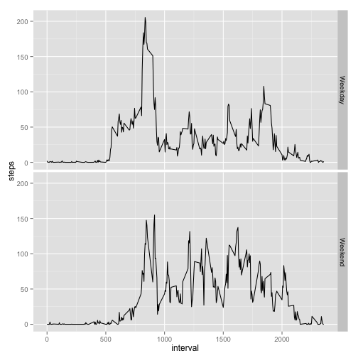

# Reproducible Research: Peer Assessment 1

## Configure options

```r
opts_chunk$set(echo=TRUE)
```

## Loading and preprocessing the data

We load the data directly from the zip file

```r
file <- unz("activity.zip", "activity.csv")
data <- read.csv(file)
```

## What is mean total number of steps taken per day?

### Ignoring missing values, what is the distribution of steps per day

```r
  #Ignore missing values
  nona <- na.omit(data)
  daily <- with(nona, aggregate(steps, list(date), sum))
  names(daily) <- c("date", "steps")
  hist(daily$steps, main="Steps per day", xlab="Steps", ylab="Days")
```

 

### What are the mean and median number of steps per day?

```r
  mean1 <- mean(daily$steps, na.rm = TRUE)
  mean1
```

```
## [1] 10766
```

```r
  med1 <- median(daily$steps, na.rm = TRUE)
  med1
```

```
## [1] 10765
```

## What is the average daily activity pattern?

### What is the distribution of activity throughout the average day?

```r
  byInterval <- with(nona, aggregate(steps, list(interval), sum))
  names(byInterval) <- c("interval", "steps")
  plot(byInterval, type="l")
```

 

### What is the most active 5 minute interval?

```r
  byInterval[[which.max(byInterval$steps), "interval"]]
```

```
## [1] 835
```

## Imputing missing values

### How many NAs are there?

```r
  missingIndicies <- which(is.na(data$steps))
  length(missingIndicies)
```

```
## [1] 2304
```

### Fill NAs with median for a given interval

```r
  intervalMed <- with(nona, aggregate(steps, list(interval), median))
  names(intervalMed) <- c("interval", "steps")
  for(i in missingIndicies) {
    interval <- data[[i, "interval"]]
    steps <- intervalMed[intervalMed$interval == interval, "steps"]
    data[i, "steps"] <- steps
  }
```

### What is the distribution of steps per day, with missing values guessed?

```r
  daily <- with(data, aggregate(steps, list(date), sum))
  names(daily) <- c("date", "steps")
  hist(daily$steps, main="Steps per day", xlab="Steps", ylab="Days")
```

 

### What is the mean and median number of steps per day, with missing values guessed?

```r
  mean2 <- mean(daily$steps)
  mean2
```

```
## [1] 9504
```

```r
  med2 <- median(daily$steps)
  med2
```

```
## [1] 10395
```

### How do the the estimates of steps per day differ when missing values are guessed?

```r
  meanPctDiff <- (mean1 - mean2)/mean1 * 100
  sprintf("mean differs by %.1f%%", meanPctDiff)
```

```
## [1] "mean differs by 11.7%"
```

```r
  medPctDiff <- (med1 - med2)/med1 * 100
  sprintf("median differs by %.1f%%", medPctDiff)
```

```
## [1] "median differs by 3.4%"
```

## Are there differences in activity patterns between weekdays and weekends?

```r
  library(ggplot2)
  data$date <- as.Date(data$date)
  isWeekend <- as.factor(ifelse(weekdays(data$date) == "Sunday" | weekdays(data$date) == "Saturday", "Weekend", "Weekday"))
  data <- cbind(data, isWeekend)
  byInterval <- with(data, aggregate(steps, list(interval, isWeekend), sum))
  names(byInterval) <- c("interval", "isWeekend", "steps")
  qplot(interval, steps, data=byInterval, facets= isWeekend ~ ., geom=c("line"))
```

 
